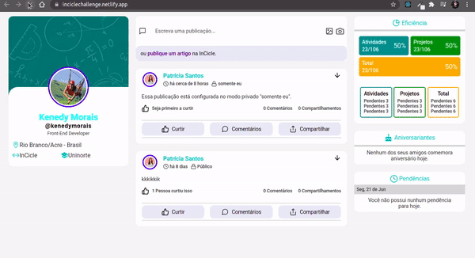

<h4 align="center">
  
</h4>
<p align="center">
  <a href="#sobre"> </a>
  <a href="#layout"> </a>
</p>
<br>

<div align="center">
<a href="https://inciclechallenge.netlify.app/" target="_blank">
  
  </a>
  <br><br>
<hr>
</div><br>
<h2 id="sobre">🔎 Sobre o Projeto</h2>
Simple Web page make with React.js and Typescript. All styles were making with Styled Components library.

<h2 id="tecnologias">⚙️ Tecnologias utilizadas</h2>
➙ React.js / React Hooks <br>
➙ TypeScript
<h2>📍Bibliotecas adicionais</h2>
➙ Styled Components <br>
➙ React-icons
<h2 id="layout">✨ Layout</h2>
<div align="center">

</div>
<h2>💡Rode na sua máquina</h2>

```
# Clone this repository
$ git clone https://github.com/diegomagalhaes-dev/crypto-daily.git

# Install dependencies 
$ yarn 

# Run the application
$ yarn start

# (You must have Node, Yarn and Git installed on your machine)
```
